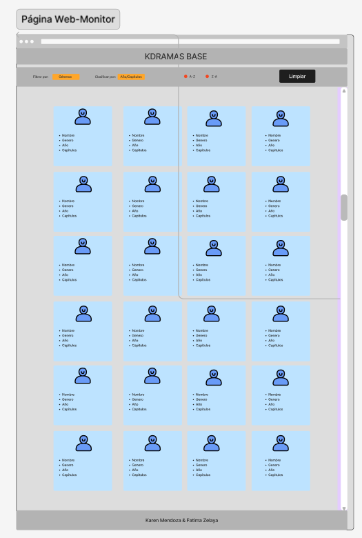
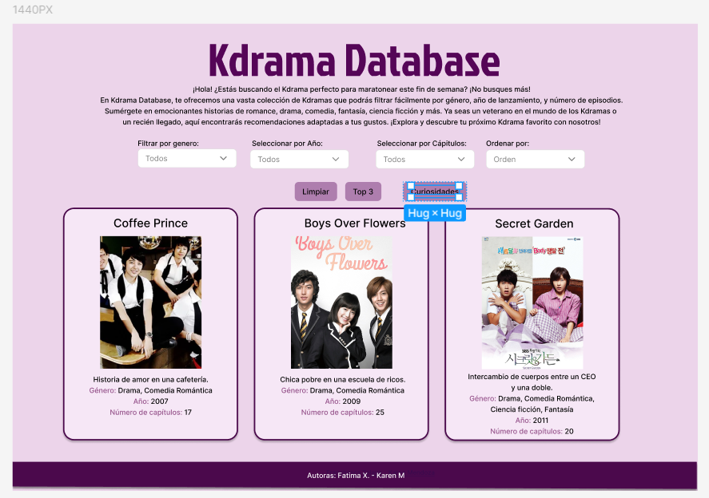
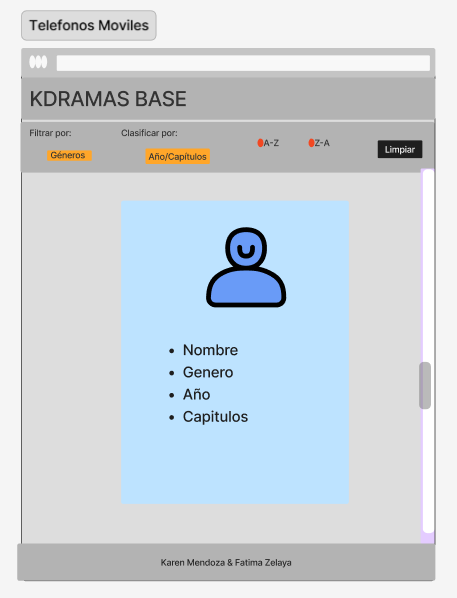
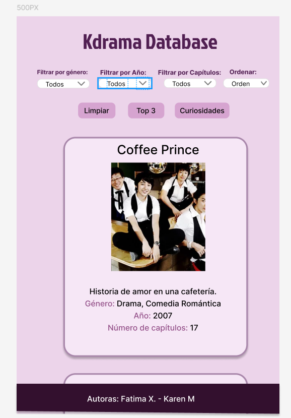

# Kdrama Database

## Índice

- [1. Resumen del proyecto](#1-resumen-del-proyecto)
- [2. Definición de producto](#2-definición-de-producto)
- [3. Historias de Usuario](#3-historias-de-usuario)
- [4. Generación de datos](#4-generación-de-datos)
- [5. Diseño de Interfaz y Prototipos](#5-diseño-de-interfaz-y-prototipos)
- [6. Lenguajes y Herramientas Utilizadas](#6-lenguajes-y-herramientas-utilizadas)
- [7. Responsividad](#7-responsividad)
- [8. Testing](#8-testing)
- [9. Trabajo Colaborativo](#9-trabajo-colaborativo)

---

## 1. Resumen del proyecto

**Kdrama Database** es una página web diseñada para facilitar la búsqueda y filtrado de doramas coreanos.Los usuarios pueden filtrar doramas por género, año de lanzamiento y número de episodios, así como ver estadísticas como el promedio de capítulos, el género más común y el dorama con el mayor ranking.

Además, podras ver los 3 primeros Kdramas mas visto en lo que lleva del año 2007 al 2023, tambien con la función de limpiar con un solo click puedes reiniciar la busqueda, lo que facilita el filtrado de nuevos datos.

## 2. Definición de producto

En consideración con la lluvia de ideas inicial, identificamos que el **usuario de Kdrama Database** incluye en su mayoría mujeres entre 20-45 años. Este público busca pasar el rato viendo una serie tomando en cuenta ciertos puntos como la cantidad de cápitulos lo que le permitiria calcular cuando tiempo debe dedicarle a la serie y escoger una serie de acuerdo a su género de su preferencia.

### Necesidades:

- **Información Rápida y Clara:** El proyecto está diseñado para proporcionar información precisa sobre diversos Kdramas. Cada Kdrama incluyendo detalles esenciales como el nombre, una breve descripción, el género, el año de lanzamiento y el número de capítulos. Esto facilita a los usuarios el acceso rápido a la información que necesitan para decidir qué Kdrama ver.

- **Filtrado de Información:** Los usuarios tienen la capacidad de filtrar la información de los Kdramas según distintos criterios, como el género, el año de lanzamiento y el número de capítulos.

- **Ordenamiento de Datos:** El proyecto incluye opciones para ordenar la información filtrada, los datos pueden ordenarse en orden ascendente o descendente según varios atributos, como el nombre del Kdrama, el año de lanzamiento, el número de capítulos.

- **Acceso a Estadísticas:** Los usuarios pueden acceder a estadísticas que incluyen el promedio de capítulos, el género más común entre los Kdramas disponibles, y el Kdrama con el mayor porcentaje de audiencia. Esta información es útil para los usuarios que desean comprender mejor las tendencias y características de los Kdramas.

### Resolución de Necesidades del Usuario:

KdramaDatabase es una solución web que responde a todas las necesidades de los entusiastas de los Kdramas. La plataforma permite a los usuarios explorar y descubrir los últimos y más populares Kdramas, ofreciendo las siguientes funcionalidades:

- **Visualización Dinámica:** Los usuarios exploran Kdramas de forma intuitiva con una interfaz visualmente atractiva. Cada Kdrama incluye nombre, imagen, descripción breve, género, año de lanzamiento y número de capítulos.
- **Filtros Avanzados:** Sistema eficiente para aplicar y quitar filtros con un click, permitiendo búsquedas personalizadas por género, año y número de capítulos.
- **Ordenación Flexible:** Opciones para ordenar el título de los Kdramas en forma ascendente y descendente.
- **Acceso a Rankings:** Visualización de datos como promedio de capítulos, géneros más comunes, ratings más altos y el top 3 de los Kdramas mas vistos, ayudando a los usuarios a entender tendencias y tomar decisiones informadas.

## 3. Historias de Usuario 🚀

### Historia de Usuario 1: Filtro por Genero

**Definición de Terminado (DoD):**
- **Quién:** Como usuaria.
- **Qué:** Quiero filtrar los Kdramas por género
- **Para:** Que pueda ver únicamente los Kdramas que corresponden a mi preferencia de género.  

**Criterios de Aceptación (AC):**
- Debe haber un menú desplegable con opciones de      
  diferentes géneros.
- Al seleccionar un género, la lista de Kdramas debe 
  actualizarse para mostrar solo aquellos que corresponden al 
  género seleccionado.
- Si selecciono "all", todos los Kdramas deben ser visibles.

### Historia de Usuario 2: Filtro por Año

**Definición de Terminado (DoD):**
- **Quién:** Como usuaria. 
- **Qué:** Quiero filtrar los Kdramas por año de lanzamiento.  
- **Para:** Que pueda ver únicamente los Kdramas lanzados en un año específico.

**Criterios de Aceptación (AC):**
- Debe haber un menú desplegable con opciones de 
  diferentes años.
- Al seleccionar un año, la lista de Kdramas debe actualizarse 
  para mostrar solo aquellos lanzados en el año seleccionado.
- Si selecciono "all", todos los Kdramas deben ser visibles.

### Historia de Usuario 3: Filtro por Número de Capítulos

**Definición de Terminado (DoD):**
- **Quién:** Como usuaria. 
- **Qué:** Quiero filtrar los Kdramas por número de capítulos. 
- **Para:** Que pueda ver únicamente los Kdramas con un número específico de capítulos.

**Criterios de Aceptación (AC):**
- Debe haber un menú desplegable con opciones para diferentes   
  números de capítulos.
- Al seleccionar un número de capítulos, la lista de Kdramas 
  debe actualizarse para mostrar solo aquellos con el número de 
  capítulos seleccionado.
- Si selecciono "all", todos los Kdramas deben ser visibles.

### Historia de Usuario 4: Ordenar Kdramas por Nombre

**Definición de Terminado (DoD):**
- **Quién:** Como usuaria. 
- **Qué:** Quiero ordenar la lista de Kdramas alfabéticamente por nombre. 
- **Para:** Que pueda encontrar fácilmente un Kdrama específico por su nombre.

**Criterios de Aceptación (AC):**
- Debe haber un menú desplegable con opciones para 
  ordenar alfabéticamente en orden ascendente y descendente.
- Al seleccionar una opción de orden, la lista de Kdramas debe 
  actualizarse para reflejar el orden seleccionado.
- La ordenación debe aplicarse sobre la lista filtrada actual, 
  si hay filtros activos.

## 4. Generación de datos 📝

A continuación, se adjuntan capturas de pantalla del prompt solicitado a la IA para la generación del conjunto de datos utilizado en la aplicación web. [ChatGPT](https://chatgpt.com/share/48e46d80-b8cd-4c6a-af3b-71506beacaf5)

)
)

Asi mismo, se adjunta captura de pantalla de la respuesta proporcionada por las IA.

)
) 

## 5. Diseño de Interfaz y Prototipos 📋

La interfaz de **KdramaDatabase** está diseñada para ofrecer una experiencia intuitiva y atractiva, permitiendo a los usuarios explorar, aprender y disfrutar de Kdramas de manera eficiente y organizada. Con un enfoque en la usabilidad y la presentación clara de información, el diseño facilita la navegación y la comprensión de los datos sobre cada Kdrama.

### Prototipos de Alta Fidelidad:

El prototipo de alta fidelidad de **KdramaDatabase** es la versión más detallada y refinada de la interfaz, integrando todos los estilos visuales y elementos interactivos para ofrecer una experiencia de usuario completa y envolvente. Este prototipo incorpora la estética final, la funcionalidad completa y la interacción intuitiva, sirviendo como una base precisa para el desarrollo final de la aplicación. A continuación, se adjuntan algunas imágenes del prototipo de alta fidelidad de la aplicación web.

## 6. Lenguajes y Herramientas Utilizadas 🛠️

En el desarrollo de nuestro proyecto, hemos utilizado un lenguaje de programación y herramientas para garantizar su funcionalidad y diseño. A continuación, detallamos el principal lenguaje y herramientas que forman parte de nuestro proyecto:

### Herramientas de Programación

- **HTML Semántico:** Utilizado para estructurar y marcar nuestra página web de manera clara y accesible, definiendo la disposición y los elementos visuales de forma adecuada.

- **CSS Responsive:** Utilizado para diseñar y presentar la interfaz de manera que mejora la experiencia del usuario. Se han aplicado estilos, colores y diseños mediante media queries, flexbox y grid para asegurar una visualización óptima en diversos dispositivos y tamaños de pantalla.

### Lenguaje de Programación

- **JavaScript (JS):** Esencial para la interactividad y la funcionalidad dinámica de nuestra aplicación web. Empleado para la creación dinámica de elementos HTML, manipulación del DOM con event listeners, y funciones que permiten acciones y comportamientos en tiempo real.

### Herramientas Adicionales

- **Control de Versiones (Git):** Esencial para el seguimiento eficiente de cambios en el código, facilitando la colaboración entre desarrolladores en nuestro proyecto de Kdramas.
- **Pruebas Unitarias(Jest):** Utilizado para asegurar la calidad y robustez del código JavaScript mediante pruebas exhaustivas, garantizando su funcionamiento y rendimiento en el contexto de nuestra aplicación de Kdramas.
- **Prototipado y Diseño de Interfaz (Figma):** Utilizado para el prototipado y diseño de la interfaz, permitiendo la creación de maquetas visuales y la planificación de la experiencia de usuario. [Prototipo-figma]()
- **Historias de Usuario:** Utilizadas para definir claramente los requisitos y expectativas de los usuarios finales en nuestro proyecto de Kdramas. Aseguran que el desarrollo esté alineado con las necesidades y deseos de los usuarios.

Estos elementos y herramientas nos han permitido desarrollar una aplicación web completa y funcional para Kdramas, con un diseño atractivo y una experiencia de usuario optimizada. La combinación de HTML semántico, CSS responsive, JavaScript y herramientas como Git, Jest y Figma ha sido crucial para lograr un producto robusto, interactivo y de alta calidad.

## 7. Responsividad

### 7.1. Testing

## 8. Trabajo Colaborativo 📌

### Herramientas de Colaboración ⌨️

### Equipo de Diseño y Desarrollo ✒️

- 
- 
